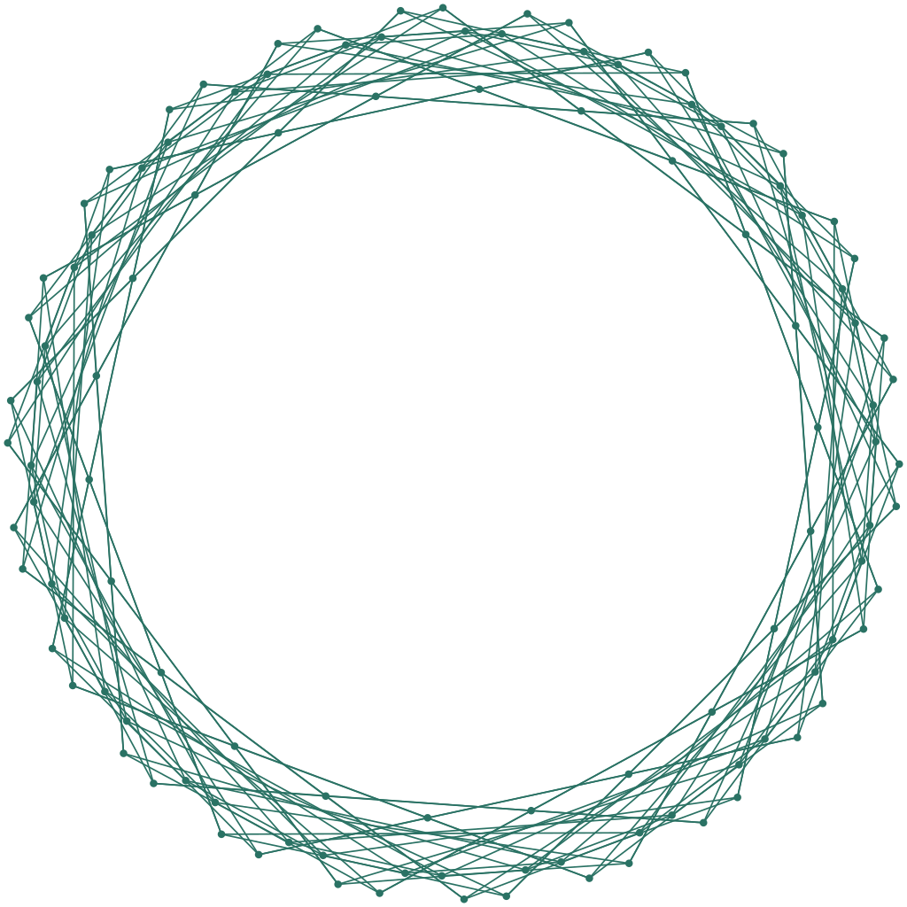
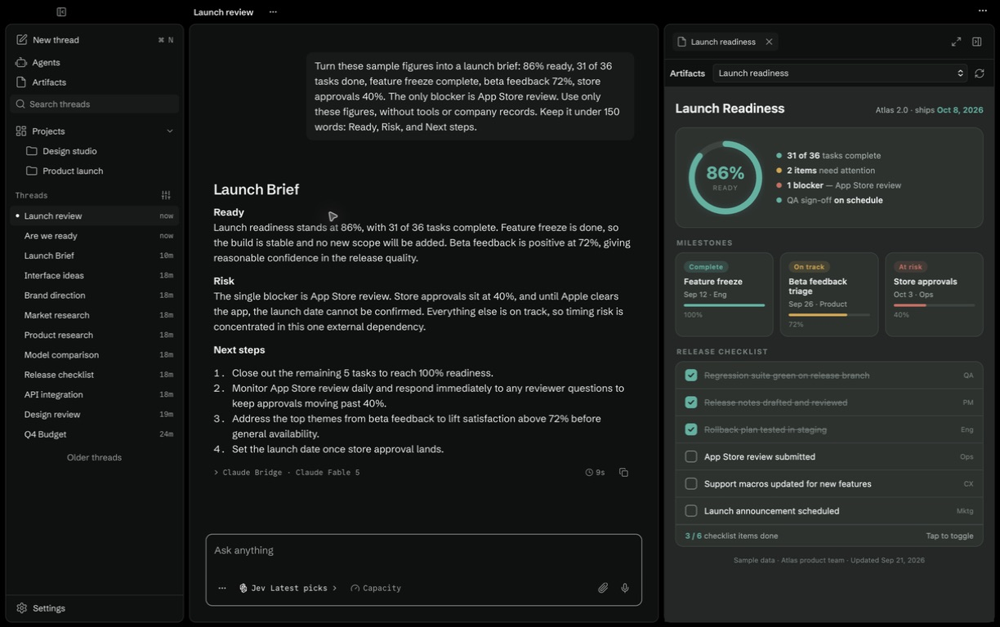

<p align="center">
  <a href="https://muniment.ai"></a>
</p>

<h1 align="center">Your models. Working together.</h1>

<p align="center">
  A free desktop app for your models, tools, and files. No Muniment account required.
</p>

<p align="center">
  <a href="https://muniment.ai">Website</a> ·
  <a href="https://muniment.ai/docs/">Docs</a> ·
  <a href="https://muniment.ai/docs/install/">Get the app</a> ·
  <a href="https://muniment.ai/docs/start/">Getting started</a>
</p>

<p align="center">Free desktop · Source under FSL.</p>

[](https://muniment.ai)

## Features

- **Your models, together.** Connect provider accounts, API keys, or local models. Choose a model or let Jev route each request.
- **One workspace.** Keep projects, chats, files, a terminal, and a browser together.
- **Tools that fit your work.** Add MCP servers, skills, and plugins. Choose what each turn can use.
- **Agents and artifacts.** Create reusable agents and interactive outputs beside the conversation.
- **Memory and voice.** Keep context across chats and use on-device voice.

## Start

Download Muniment for your platform:

- [macOS — Apple silicon and Intel](https://github.com/munimentai/muniment/releases/download/v0.0.1/nightly-84e8c1b74dc2030449dc91de890691627f659ce9-macos-muniment.pkg)
- [Windows — x64 installer](https://github.com/munimentai/muniment/releases/download/v0.0.1/nightly-84e8c1b74dc2030449dc91de890691627f659ce9-windows-muniment_0.0.1_x64_en-US.msi)
- [Ubuntu / Debian — x64](https://github.com/munimentai/muniment/releases/download/v0.0.1/nightly-84e8c1b74dc2030449dc91de890691627f659ce9-linux-muniment.deb)
- [Linux — x64 AppImage](https://github.com/munimentai/muniment/releases/download/v0.0.1/nightly-84e8c1b74dc2030449dc91de890691627f659ce9-linux-muniment_0.0.1_amd64.AppImage)

See the [install guide](https://muniment.ai/docs/install/) for platform requirements
and [all downloads](https://github.com/munimentai/muniment/releases/latest) for alternate installers.

Open the app, [connect a provider](https://muniment.ai/docs/connections/), and start a thread.
Follow the [getting started guide](https://muniment.ai/docs/start/) for your first project.

### Homebrew

The official Homebrew cask is not available yet. Use the macOS download above.
Once Homebrew accepts the cask, install with:

```sh
brew install --cask muniment
```

## Issues and license

[Report a bug or request a feature](https://github.com/munimentai/muniment/issues).
Outside code contributions are not accepted. See [CONTRIBUTING.md](CONTRIBUTING.md)
and [SECURITY.md](SECURITY.md) for issue and private vulnerability reports.

Muniment uses [FSL-1.1-ALv2](LICENSE.md), a Fair Source license.
Each version converts to Apache 2.0 after two years.
Third-party components retain their own licenses.
See the [test architecture](docs/decisions/0013-desktop-e2e-harness.md) for verification details.
