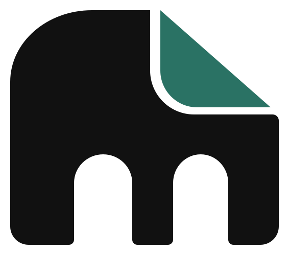
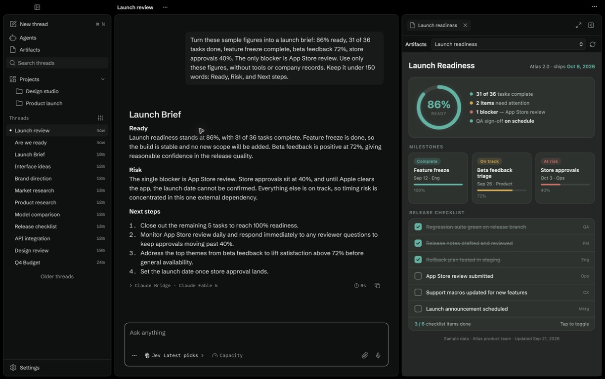

<p align="center">
  <a href="https://muniment.ai">
    <picture>
      <source media="(prefers-color-scheme: dark)" srcset="docs/assets/pocket-fold-reverse.svg" />
      
    </picture>
  </a>
</p>

<h1 align="center">Your models. Working together.</h1>

<p align="center">
  A free desktop app for your models, tools, and files. No Muniment account required.
</p>

<p align="center">
  <a href="https://muniment.ai">Website</a> ·
  <a href="https://muniment.ai/docs/">Docs</a> ·
  <a href="https://muniment.ai/docs/install/">Get the app</a> ·
  <a href="https://muniment.ai/docs/start/">Getting started</a>
</p>

<p align="center">Free desktop · Source under FSL.</p>

[](https://muniment.ai)

## Features

- **Your models, together.** Connect provider accounts, API keys, or local models. Choose a model or let Jev route each request.
- **One workspace.** Keep projects, chats, files, a terminal, and a browser together.
- **Tools that fit your work.** Add MCP servers, skills, and plugins. Choose what each turn can use.
- **Agents and artifacts.** Create reusable agents and interactive outputs beside the conversation.
- **Memory and voice.** Keep context across chats and use on-device voice.

## Start

Download Muniment for your platform:

- [macOS — Apple silicon and Intel](https://github.com/munimentai/muniment/releases/download/v0.0.1/muniment-0.0.1-macos.pkg)
- [Windows — x64 installer](https://github.com/munimentai/muniment/releases/download/v0.0.1/muniment-0.0.1-windows_x64_en-US.msi)
- [Ubuntu / Debian — x64](https://github.com/munimentai/muniment/releases/download/v0.0.1/muniment-0.0.1-linux.deb)
- [Linux — x64 AppImage](https://github.com/munimentai/muniment/releases/download/v0.0.1/muniment-0.0.1-linux_amd64.AppImage)

See the [install guide](https://muniment.ai/docs/install/) for platform requirements
and [all downloads](https://github.com/munimentai/muniment/releases/latest) for alternate installers.

Open the app, [connect a provider](https://muniment.ai/docs/connections/), and start a thread.
Follow the [getting started guide](https://muniment.ai/docs/start/) for your first project.

### AppImage sandbox setup

Ubuntu 24.04 restricts unprivileged user namespaces. The AppImage needs a host sandbox helper on these systems, even without the DEB.
The AppImage includes a setup script and the Chromium sandbox helper.

1. Download the AppImage from the official release.
2. In an empty directory, extract its sandbox setup.

```sh
chmod +x /path/to/muniment.AppImage
/path/to/muniment.AppImage --appimage-extract usr/lib/muniment/cef/chrome-sandbox
/path/to/muniment.AppImage --appimage-extract setup-sandbox.sh
```

3. Install the helper with administrator access.

```sh
sudo /bin/sh squashfs-root/setup-sandbox.sh
```

4. Remove the extracted files.

```sh
rm -r squashfs-root
```

5. Run the original AppImage as your normal user.

The setup requires a setuid-enabled executable filesystem at `/usr/lib/muniment/cef`.
It keeps Chromium's sandbox enabled and leaves the host's user namespace policy unchanged.
Run setup for each AppImage update. Matching helpers need no changes.
If setup reports a different helper, keep the DEB helper when the DEB is installed.
For an AppImage-only installation, close Muniment and remove `/usr/lib/muniment/cef/chrome-sandbox` with `sudo rm` before setup.
To uninstall an AppImage-only installation, remove that helper and the AppImage.

### Homebrew

The official Homebrew cask is not available yet. Use the macOS download above.
Once Homebrew accepts the cask, install with:

```sh
brew install --cask muniment
```

## Releases

GitHub Releases on `munimentai/muniment` host every download. Forgejo Actions at `factory/muniment` build and publish them.
Only an owner dispatch of `main` runs a release job. Each job checks this in its first step and fails before any credential is read.

1. Dispatch `nightly.yml` on `main`. It signs the three platform builds, uploads them to the `nightly` pre-release, and runs the installed checks.
2. Dispatch `subscriptions.yml` on GitHub with the nightly source SHA. Its native runners are on GitHub.
3. Dispatch `release.yml` on `main` with the source SHA, the version, and `dry_run` set. The dry run runs every check and creates nothing.
4. Dispatch `release.yml` again without `dry_run`. It creates the version tag on Forgejo, and the push mirror carries it to GitHub.
   The job then publishes the verified nightly bytes, `latest.json`, and `SHA256SUMS` as the stable release.

The `GH_RELEASE_TOKEN` secret holds a fine-grained GitHub token with Contents write on `munimentai/muniment`.
Every GitHub Releases call uses it. The job token reaches only Forgejo.

## Issues and license

Report a bug or request a feature by email to [support@muniment.ai](mailto:support@muniment.ai).
Outside code contributions are not accepted. See [CONTRIBUTING.md](CONTRIBUTING.md)
and [SECURITY.md](SECURITY.md) for issue and private vulnerability reports.

Muniment uses [FSL-1.1-ALv2](LICENSE.md), a Fair Source license.
Each version converts to Apache 2.0 after two years.
Third-party components retain their own licenses.
See the [test architecture](docs/decisions/0013-desktop-e2e-harness.md) for verification details.

`npm run check:agent-dependencies` checks Claude Code, Pi, and extension pins against current releases and Pi peer ranges.
Updates require the focused regression tests and the native CI and installed nightly checks.
`npm run test:agent-runtime` checks extension loading, selected models, streamed completion, and cache usage against a local fixture.
Set `PI_TEST_BINARY` to the verified Pi executable and `PI_TEST_PACKAGES` to an isolated frozen install of `pins/packages.bun.lock` from the `muniment-core` release tag.
