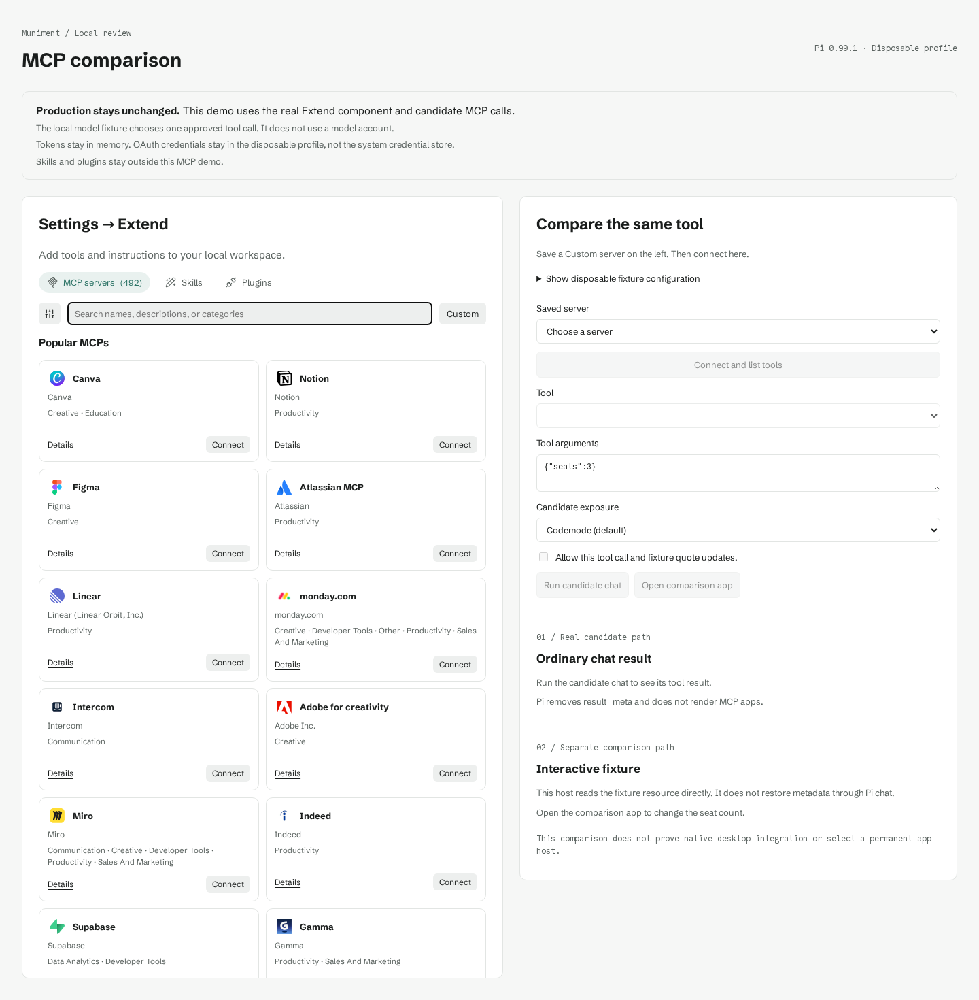
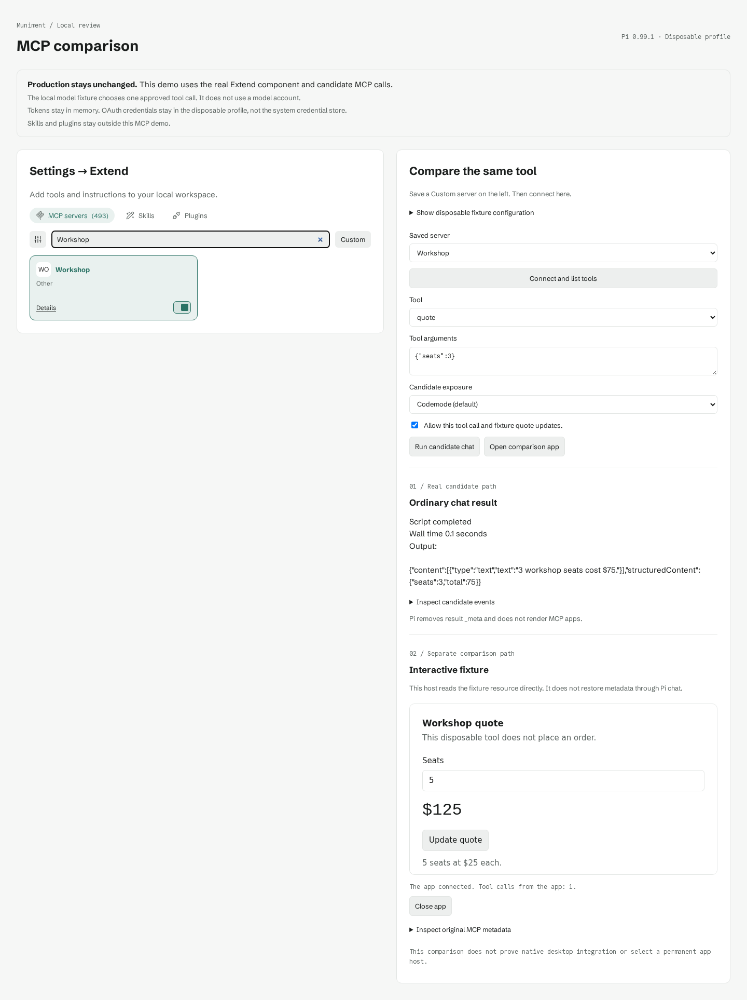

# Compare the MCP candidate.

This disposable browser demo loads the unchanged `src/extend/ExtendSection.svelte` component and its catalog.
It connects saved servers through the official Pi 0.99.1 CLI.
It does not change the desktop runtime, adapter, production pins, rollback, or existing profiles.

## Run the demo.

Use Node 24 and npm on Linux or macOS. The first launch needs registry access.
Run this command from the repository root:

```sh
node prototypes/mcp-demo/run.mjs
```

The launcher copies the demo and frontend sources into a temporary directory outside the checkout.
It runs `npm ci --ignore-scripts --strict-peer-deps` against the demo lock, then checks `npm ls --all`.
It prints a loopback URL with a free port. Open that URL in a browser.
Press Ctrl+C to stop the demo and delete its temporary installation, saved servers, and credentials.
A forced kill can leave temporary directories. Never point the demo at a real profile.

## Compare the fixture.

1. Open **Show disposable fixture configuration** on the right.
2. Copy the displayed stdio JSON.
3. Click **Custom** on the left.
4. Enter **Workshop** in **Name**.
5. Open **Local command or advanced configuration**.
6. Paste the JSON into **Server configuration**.
7. Click **Save server**.
8. Confirm the disposable connection consent.
9. Select **Workshop** on the right.
10. Click **Connect and list tools**.
11. Check **Allow this tool call and fixture quote updates**.
12. Click **Run candidate chat**.
13. Click **Open comparison app**.
14. Change the app's seat count to **5**.
15. Click **Update quote**.

The candidate receives the actual MCP result for three seats at $75.
The app makes another MCP call and displays five seats at $125.
The app does not place orders or write user data.
Select **Direct** under **Candidate exposure** to compare direct results with the default Codemode path.
The event disclosure shows the candidate's actual tool and chat events.

For HTTP, add another Custom entry with the displayed streamable HTTP URL.
The fixture accepts **None or token** and **Sign in with OAuth** without credentials because it requires no authentication.
The OAuth selection runs the official login command, which detects the existing unauthenticated connection.
It does not prove an OAuth challenge or token refresh.

## Exercise the connection controls.

Search the catalog for **Notion**. **Details** shows its real provider URL and links.
**Connect** saves that provider entry and invokes the candidate's official `pi mcp login` flow.
Provider sign-in needs a local desktop browser and the provider's account requirements.
Use only disposable accounts and servers. Remote providers can require subscriptions.
This demo does not redirect catalog entries to the fixture.

Saved Custom entries survive page reloads within the demo process.
Their Details dialog retains **Test connection**, **Configure**, and **Uninstall**.
The catalog switch controls whether the demo permits tool calls.
Changing a definition clears its connection proof and requires another test.
The comparison tool picker lists the selected server's real tools.
Its arguments field accepts a JSON object for the approved call.

To see a connection error, configure Workshop with this JSON:

```json
{"command":"muniment-demo-command-does-not-exist"}
```

Click **Test connection** in Details. The error names the checks needed for a retry.
Restore the displayed fixture JSON, then test again.
For a tool error, run the candidate with `{"seats":3,"fail":true}`.
Seat counts outside the integer range 1–20 also fail.

## Understand the two paths.

The local model fixture selects one approved tool call, then echoes its actual output.
Pi runs its real chat loop, built-in MCP extension, Codemode extension, and tool permission handler.
No model account or Muniment account participates. This is not proof of a real provider conversation.

The candidate removes result `_meta`, including the fixture's UI resource URI and private marker.
It retains text and structured results. Its resource listing omits the fixture's app resource.
Pi 0.99.1 does not render MCP apps.
The tests verify these losses against the installed executable, not a replacement conversion function.

The separate comparison host reads the same fixture's `ui://` resource directly through Pi's MCP client.
The official MCP Apps `AppBridge` supplies the initialization handshake and tool-result messages.
The app uses the official `App` client to call the fixture again.
This path does not pass through Pi chat or recover its missing metadata.
It proves the fixture interaction, not production panel integration.

Only the exact disposable fixture configuration can reach this app host.
An opaque-origin iframe blocks access to the parent document.
The fixture's CSP blocks network access. The host permits only the fixture's quote tool.
It does not host arbitrary provider apps, open links, or claim general MCP Apps conformance.
The owner still chooses the permanent host. This demo removes no production panels.

## Keep the boundaries intact.

The demo starts a fresh agent directory, working directory, HOME, and credential scope.
It copies no production configuration or credentials. It never passes `--approve`.
It disables automatic extension, skill, prompt, and context-file discovery.
It explicitly loads `builtin:mcp`, `builtin:codemode`, and the demo permission extension despite `--no-extensions`.
Its `defaultTools` contains `codemode`. It grants no file or shell tools to the model.
The permission handler accepts only the exact approved tool arguments and Codemode script.

Custom stdio commands still run with the operating system user's permissions.
Saving a command and connecting require user consent. This is not an operating system sandbox.
Headers and server environment values accept only `${DEMO_NAME}` references from explicitly supplied `DEMO_` variables.
The demo rejects shell substitutions, plaintext header secrets, contradictory transports, invalid timeouts, SSE, and Unix sockets.
Unsupported fields fail before any save. Original profiles remain untouched.

Bearer tokens stay in process memory, despite the unchanged production form's credential-store placeholder.
The demo confirms that difference before saving a token.
Changing the endpoint or choosing OAuth clears the demo bearer token.
Official OAuth stores credentials inside the disposable agent directory.
Uninstall clears its OAuth credentials when no other demo entry uses that URL.
The cleanup profile omits Authorization headers, including bearer tokens and environment references.
A cleanup error keeps the saved server for a retry.
No credential migration or system credential-store integration occurs.
Skills, plugins, favicon acquisition, and the desktop permission UI stay outside this MCP demo.

The API binds only to loopback and checks the host, origin, and per-launch request token.
It serializes mutations and tool calls against one disposable profile.
The comparison binds approval to the connected server revision and rejects stale, disabled, removed, or untested servers.
Configuration changes, credential changes, and sign-in invalidate approval across tabs.
After a stale request, connect again and approve a fresh tool call.

## Review the evidence.

The screenshots show the running browser demo, not mockups.
The browser check captures the connection controls and results from real tool calls.

- [View the catalog.](catalog.png)
- [View the Custom dialog.](custom.png)
- [Compare chat output with the live app.](comparison.png)
- [View the connection error.](connection-error.png)
- [Inspect the original result and candidate events.](boundary.json)





## Verify the demo.

Run each focused check from the repository root:

```sh
node prototypes/mcp-demo/run.mjs test
node prototypes/mcp-demo/run.mjs test:browser
node prototypes/mcp-demo/run.mjs build
scripts/check-steering.sh .
```

The browser check installs its pinned Chromium outside the checkout if needed.
It prints the temporary evidence directory, including new screenshots and `boundary.json`.
It also runs the Playwright screenshot CLI against the launch URL.
The build checks the browser bundle. The Node server supplies runtime APIs, so do not launch the static build alone.

The focused tests cover both transports, direct and Codemode chat, metadata loss, connection failures, custom edits, saved state, and credential scope.
They also cover permission denial, project trust, invalid inputs, serialized saves, failed writes, timeouts, disabled servers, and cross-origin rejection.
The focused tests cover token removal, Authorization references, shared OAuth credentials, and cleanup failures.
The browser check covers catalog Details, provider save, canceled sign-in, Custom save, reload, configure, uninstall, and connection recovery.
It also verifies permission revocation, a live app tool call, and stale approvals across two tabs.
It checks the iframe boundary and exercises Custom HTTP sign-in without private credentials.

This demo pins the MCP probe graph only. It does not install the four optional extension packages or the adapter.
The production graph still retains those packages, including the Claude bridge.
The full approved extension graph and any background-tasks compatibility build belong to the later production migration.
This demo neither promotes that graph nor changes SPEC or ADR 0008's runtime contract.
Production promotion still requires the owner's review, rollback proof, and native installed chat and MCP proof on all three platforms.
No native installed proof accompanies this browser demo.

## Follow the upstream contracts.

- [Read Pi 0.99.1's MCP contract.](https://github.com/earendil-works/pi/blob/v0.99.1/packages/coding-agent/docs/mcp.md)
- [Read the official MCP Apps host example.](https://github.com/modelcontextprotocol/ext-apps/tree/main/examples/basic-host)
- [Read Claude's interactive connector pattern.](https://support.claude.com/en/articles/13454812-use-interactive-connectors-in-claude)

The comparison follows the tool-result disclosure and inline interaction pattern from these references.
It uses Muniment's shared controls, catalog, fonts, and theme tokens.
The Pi packages, MCP SDK, and MCP Apps SDK retain their MIT licenses in the temporary installation.
The frozen lock records each dependency's registry archive integrity.
Pi's shrinkwrap repeats some Pi packages at 0.99.1 and omits seven nested integrity fields.
The demo lock supplies those digests after verification against downloaded archives and registry metadata.
The graph test rejects missing digests or any other Pi version.
